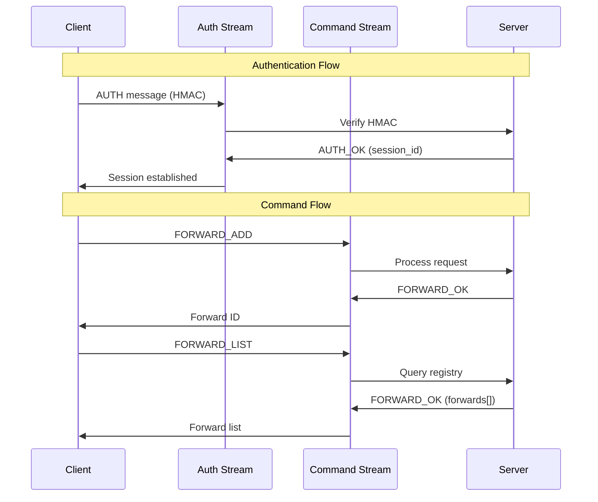

# Control Plane Protocol

The Tunnelor control plane enables runtime management of tunnels and configuration through a message-based protocol over QUIC streams.

## Overview

The control plane operates on dedicated QUIC streams separate from data streams, providing:
- **Authentication**: PSK-based client authentication
- **Session Management**: Client session tracking and lifecycle
- **Dynamic Configuration**: Add/remove forwards at runtime
- **Health Checks**: Ping/pong keepalive mechanism
- **Metrics**: Session and stream statistics

## Architecture



## Message Protocol

### Message Format

All control messages use JSON framing:

```json
{
  "type": "MESSAGE_TYPE",
  "data": { ... }
}
```

Messages are length-prefixed (4-byte big-endian) for reliable streaming.

### Message Types

| Type | Direction | Purpose |
|------|-----------|---------|
| `AUTH` | Client → Server | Authenticate with PSK |
| `AUTH_OK` | Server → Client | Authentication successful |
| `AUTH_FAIL` | Server → Client | Authentication failed |
| `FORWARD_ADD` | Client → Server | Add forward dynamically |
| `FORWARD_REMOVE` | Client → Server | Remove forward |
| `FORWARD_LIST` | Client → Server | List active forwards |
| `FORWARD_OK` | Server → Client | Forward operation success |
| `FORWARD_FAIL` | Server → Client | Forward operation failed |
| `PING` | Either | Keepalive request |
| `PONG` | Either | Keepalive response |

## Authentication

### AUTH Message

Client initiates authentication:

```json
{
  "type": "AUTH",
  "data": {
    "client_id": "my-client",
    "nonce": "random-hex-string",
    "hmac": "hmac-sha256-hex"
  }
}
```

**HMAC Calculation**:
```
payload = client_id + "|" + nonce
hmac = HMAC-SHA256(psk, payload)
```

### AUTH_OK Message

Server confirms successful authentication:

```json
{
  "type": "AUTH_OK",
  "data": {
    "session_id": "my-client-1762250774",
    "message": "Authentication successful"
  }
}
```

### AUTH_FAIL Message

Server rejects authentication:

```json
{
  "type": "AUTH_FAIL",
  "data": {
    "reason": "Invalid HMAC"
  }
}
```

## Dynamic Forward Management

### FORWARD_ADD Message

Request to add a new forward tunnel:

```json
{
  "type": "FORWARD_ADD",
  "data": {
    "local": "127.0.0.1:8080",
    "remote": "10.0.0.5:9000",
    "proto": "tcp",
    "client_id": "my-client",
    "type": "forward"
  }
}
```

**Fields**:
- `local`: Local address to listen on (forward) or public address (reverse)
- `remote`: Remote address to connect to
- `proto`: Protocol (`tcp` or `udp`)
- `client_id`: Client ID (for server-side reverse tunnels)
- `type`: `forward` or `reverse`

### FORWARD_REMOVE Message

Request to remove an existing forward:

```json
{
  "type": "FORWARD_REMOVE",
  "data": {
    "forward_id": "fwd-123"
  }
}
```

### FORWARD_LIST Message

Request to list active forwards:

```json
{
  "type": "FORWARD_LIST",
  "data": {
    "type": "forward"  // Optional filter: "forward", "reverse", or omit for all
  }
}
```

### FORWARD_OK Message

Success response for forward operations:

```json
{
  "type": "FORWARD_OK",
  "data": {
    "forward_id": "fwd-123",
    "message": "Forward added successfully",
    "forwards": [  // Only for LIST operations
      {
        "id": "fwd-1",
        "local": "127.0.0.1:8080",
        "remote": "10.0.0.5:9000",
        "proto": "tcp",
        "client_id": "my-client",
        "type": "forward",
        "active": true
      }
    ]
  }
}
```

### FORWARD_FAIL Message

Failure response for forward operations:

```json
{
  "type": "FORWARD_FAIL",
  "data": {
    "reason": "Invalid forward configuration: port already in use"
  }
}
```

## Keepalive

### PING Message

Keepalive request:

```json
{
  "type": "PING",
  "data": {
    "timestamp": 1762250774,
    "seq": 42
  }
}
```

### PONG Message

Keepalive response:

```json
{
  "type": "PONG",
  "data": {
    "timestamp": 1762250774,
    "seq": 42
  }
}
```

## Usage Examples

### Client: Add Forward at Runtime

```go
// Open command stream
commandStream, err := conn.OpenStream()
if err != nil {
    return fmt.Errorf("failed to open command stream: %w", err)
}

// Send FORWARD_ADD
result, err := clientHandler.AddForward(
    commandStream,
    "127.0.0.1:8080",  // local
    "10.0.0.5:9000",   // remote
    "tcp",             // proto
    "forward",         // type
)
if err != nil {
    return fmt.Errorf("failed to add forward: %w", err)
}

log.Info().
    Str("forward_id", result.ForwardID).
    Str("message", result.Message).
    Msg("Forward added successfully")
```

### Client: List Active Forwards

```go
result, err := clientHandler.ListForwards(
    commandStream,
    "",  // empty for all forwards
)
if err != nil {
    return fmt.Errorf("failed to list forwards: %w", err)
}

for _, fwd := range result.Forwards {
    log.Info().
        Str("id", fwd.ID).
        Str("local", fwd.Local).
        Str("remote", fwd.Remote).
        Bool("active", fwd.Active).
        Msg("Active forward")
}
```

### Server: Handle Commands

```go
// After authentication
go func() {
    if err := serverHandler.HandleCommandStream(stream); err != nil {
        log.Error().Err(err).Msg("Command stream error")
    }
}()
```

## Error Handling

### Common Error Responses

| Error | Reason |
|-------|--------|
| `Authentication failed` | Invalid client_id or HMAC |
| `Invalid forward configuration` | Missing or malformed parameters |
| `Forward already exists` | Duplicate forward ID |
| `Forward not found` | Invalid forward ID for removal |
| `Port already in use` | Local port unavailable |
| `Unknown command type` | Unsupported message type |

### Client Error Handling

```go
result, err := clientHandler.AddForward(...)
if err != nil {
    // Check if it's a FORWARD_FAIL response
    if strings.Contains(err.Error(), "forward operation failed") {
        log.Warn().Err(err).Msg("Server rejected forward request")
        // Handle gracefully
        return nil
    }
    // Network or protocol error
    return fmt.Errorf("failed to send forward request: %w", err)
}
```

## Security Considerations

1. **Authentication**: Always authenticate before accepting commands
2. **Authorization**: Verify client_id matches authenticated session
3. **Rate Limiting**: Limit command frequency per client
4. **Validation**: Validate all message fields before processing
5. **Timeouts**: Apply read/write timeouts on control streams
6. **Logging**: Log all control plane operations for audit

## Implementation Status

**Implemented** (Issue #13):
- ✅ Protocol message definitions
- ✅ Server-side command handlers
- ✅ Client-side command methods
- ✅ Comprehensive unit tests (8 new tests)
- ✅ Documentation

**Future Enhancements**:
- [ ] Integration with ForwardRegistry for actual forward management
- [ ] Dynamic forward lifecycle (start/stop listeners)
- [ ] CLI commands in tunnelorc for runtime management
- [ ] Metrics collection via control plane

## Related Documentation

- [Architecture](architecture.md) - Overall system architecture
- [Tunnel Types](tunnel-types.md) - Forward vs reverse tunnels
- [Test Documentation](test-documentation.md) - Testing guide

---

**Protocol Version**: 1.0  
**Last Updated**: 2025-11-04  
**Status**: Protocol Complete, Integration Pending
