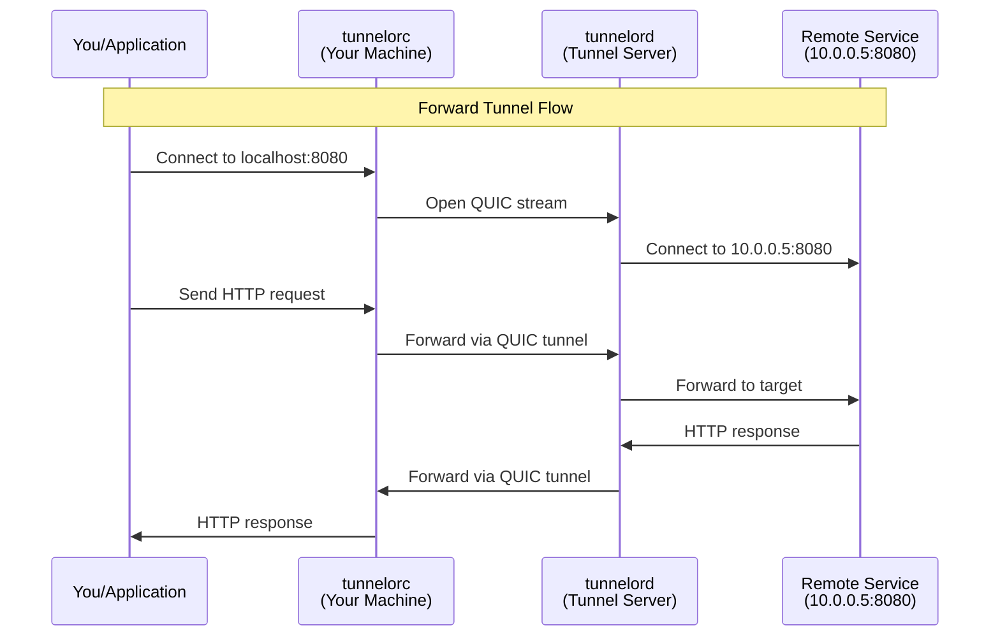
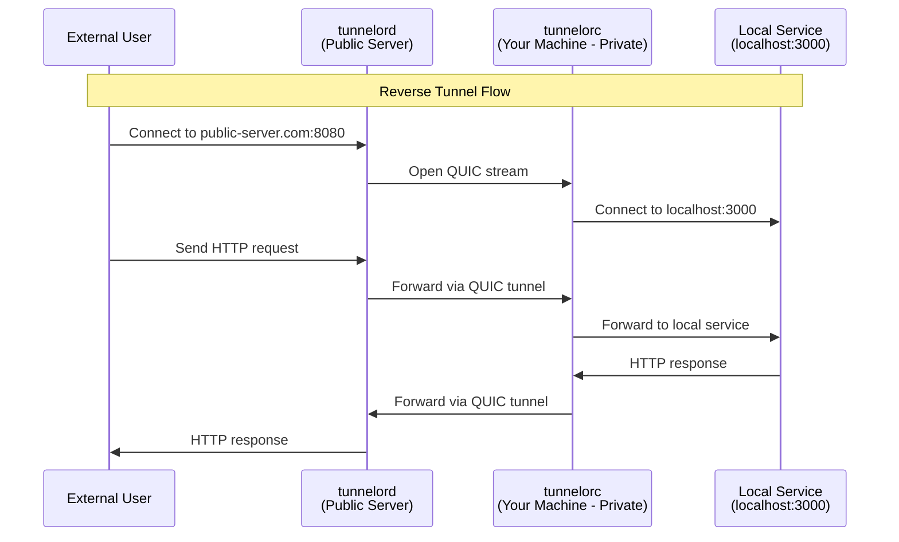

# Tunnel Types: Forward vs Reverse

This document explains the difference between forward tunnels and reverse tunnels, clarifying what Tunnelor currently supports and what's planned.

## Current Implementation: Forward Tunnels ✅

**Status**: Fully implemented and tested

### What is a Forward Tunnel?

A forward tunnel allows you to access a remote service through a tunnel server. You connect to a local port on your machine, and traffic is forwarded through the tunnel to a remote target.

**Data Flow**:
```
You → Client (localhost) → Tunnel Server → Remote Target
```

### When to Use Forward Tunnels

- Access a database that's only reachable from the server
- Reach an internal service behind a firewall (from the server's perspective)
- Bypass network restrictions to access remote resources
- Similar to SSH local port forwarding: `ssh -L 8080:remote:80 server`

### How It Works



### Configuration Example

**Server** (`tunnelord`):
```yaml
server:
  listen: 0.0.0.0:4433  # QUIC listen port
  tls_cert: /path/to/cert.pem
  tls_key: /path/to/key.pem

auth:
  psk_map:
    "my-client": "base64encodedkey=="
```

**Client** (`tunnelorc`):
```yaml
client:
  server: tunnel-server.example.com:4433
  client_id: my-client
  psk: base64encodedkey==

  forwards:
    # YOU connect to localhost:8080
    # Traffic goes to 10.0.0.5:8080 (reachable from SERVER)
    - local: 127.0.0.1:8080
      remote: 10.0.0.5:8080
      proto: tcp

    # Access database through tunnel
    - local: 127.0.0.1:5432
      remote: private-rds.internal:5432
      proto: tcp
```

**Usage**:
```bash
# Start server
./tunnelord --config server.yaml

# Start client (connects to server and sets up forwards)
./tunnelorc connect --config client.yaml

# In another terminal: Access remote service
curl http://localhost:8080
# Traffic flows: localhost:8080 → tunnel → 10.0.0.5:8080
```

### Use Cases

#### Example 1: Access Private Database
```
Problem: You need to connect to a production database that's only accessible from your AWS server

Solution:
- Run tunnelord on your AWS EC2 instance
- Run tunnelorc on your laptop
- Configure forward: local:5432 → remote:rds.internal:5432
- Connect to localhost:5432 with your database client
```

#### Example 2: Bypass Corporate Firewall
```
Problem: Your office network blocks direct access to certain services, but you have a server outside

Solution:
- Run tunnelord on your external VPS
- Run tunnelorc on your office computer
- Configure forward: local:443 → remote:blocked-site.com:443
- Access blocked-site.com through localhost:443
```

---

## Reverse Tunnels ✅

**Status**: Fully implemented - See [Issue #9](https://github.com/piwi3910/tunnelor/issues/9), [Issue #10](https://github.com/piwi3910/tunnelor/issues/10), [Issue #11](https://github.com/piwi3910/tunnelor/issues/11)

### What is a Reverse Tunnel?

A reverse tunnel allows you to expose a local service publicly through a tunnel server. External users connect to the server's public port, and traffic is forwarded through the tunnel to your local service.

**Data Flow**:
```
External User → Tunnel Server (public) → Client (private) → Local Service
```

### When to Use Reverse Tunnels

- Expose a local web application for testing (like ngrok)
- Share a localhost development server with a client
- Provide temporary access to a service behind NAT/firewall
- Similar to SSH remote port forwarding: `ssh -R 8080:localhost:80 server`

### How It Works



### Configuration Example

**Server** (`tunnelord`):
```yaml
server:
  listen: "0.0.0.0:4433"  # QUIC control plane
  tls_cert: "/etc/tunnelor/server.crt"
  tls_key: "/etc/tunnelor/server.key"

  forwards:
    # External users connect to public-server.com:8080
    # Traffic forwarded to client "dev-laptop"
    # Client forwards to localhost:3000
    - local: "0.0.0.0:8080"       # Server listens here (public)
      remote: "localhost:3000"    # Client connects here (local to client)
      proto: "tcp"
      client_id: "dev-laptop"

    - local: "0.0.0.0:5432"
      remote: "localhost:5432"
      proto: "tcp"
      client_id: "dev-laptop"

auth:
  psk_map:
    "dev-laptop": "base64encodedkey=="
```

**Client** (`tunnelorc`):
```yaml
client:
  server: "quic://tunnel-server.example.com:4433"
  client_id: "dev-laptop"
  psk: "base64encodedkey=="

  # No forward configuration needed for reverse tunnels
  # Server controls what gets exposed
```

**Usage**:
```bash
# Start server (listens on public ports)
./tunnelord --config server.yaml

# Start client (just maintains connection)
./tunnelorc connect --config client.yaml

# External users can now access your local service:
curl http://public-server.com:8080
# Traffic flows: public:8080 → tunnel → localhost:3000
```

### Use Cases

#### Example 1: Share Development Server
```
Problem: You're building a web app on localhost:3000 and want to share it with a client

Solution:
- Run tunnelord on a public VPS
- Run tunnelorc on your laptop
- Server exposes your localhost:3000 as public-server.com:8080
- Share http://public-server.com:8080 with your client
```

#### Example 2: Expose Home Services
```
Problem: You have a home server behind NAT and want to access it from anywhere

Solution:
- Run tunnelord on a cheap cloud VPS
- Run tunnelorc on your home server
- Server exposes your services publicly
- Access from anywhere via the public server
```

---

## Comparison Table

| Feature | Forward Tunnel ✅ | Reverse Tunnel ✅ |
|---------|------------------|------------------|
| **Who listens locally?** | Client | Server |
| **Who connects to target?** | Server | Client |
| **Configuration location** | Client defines forwards | Server defines forwards |
| **Use case** | Access remote resources | Expose local services |
| **Similar to** | SSH `-L` / ProxyJump | SSH `-R` / ngrok |
| **Target reachable from** | Server | Client |
| **Client behind NAT/firewall?** | OK | OK |
| **Server behind NAT/firewall?** | Must be reachable | Must be reachable |

## Hybrid Mode ✅

Tunnelor now supports **both** forward and reverse tunnels simultaneously!

**Client Configuration:**
```yaml
client:
  server: "quic://tunnel-server.example.com:4433"
  client_id: "my-laptop"
  psk: "base64encodedkey=="

  # Forward tunnels (client → server → remote)
  forwards:
    - local: "127.0.0.1:5432"     # Client listens here
      remote: "db.internal:5432"  # Server connects here
      proto: "tcp"

  # Reverse tunnels are configured on the server
  # (server will start public listeners for this client_id)
```

**Server Configuration:**
```yaml
server:
  forwards:
    # Reverse tunnel: expose client's localhost:3000 publicly
    - local: "0.0.0.0:8080"      # Server listens here (public)
      remote: "localhost:3000"   # Client connects here
      proto: "tcp"
      client_id: "my-laptop"

auth:
  psk_map:
    "my-laptop": "base64encodedkey=="
```

This allows a single client to simultaneously:
- ✅ Access remote resources through the tunnel (forward)
- ✅ Expose local services publicly (reverse)

---

## Implementation Status

### ✅ Implemented (Forward Tunnels)

- [x] Client-side local port listeners
- [x] QUIC stream opening from client to server
- [x] Server-side target connection
- [x] Bidirectional data forwarding
- [x] TCP and UDP protocol support
- [x] PSK authentication
- [x] Configuration and CLI
- [x] Comprehensive testing

### ✅ Implemented (Reverse Tunnels)

Completed in [Issue #9](https://github.com/piwi3910/tunnelor/issues/9), [#10](https://github.com/piwi3910/tunnelor/issues/10), [#11](https://github.com/piwi3910/tunnelor/issues/11)

**Core Functionality:**
- [x] Server-side public port listeners
- [x] QUIC stream opening from server to client
- [x] Client-side stream handling
- [x] Client-side target connection
- [x] Configuration structures with validation
- [x] Example configurations
- [x] Bidirectional data forwarding
- [x] TCP protocol support (UDP marked for future)

### ✅ Implemented (Hybrid Mode)

- [x] Support both forward and reverse tunnels simultaneously
- [x] Per-client configuration on server side
- [x] Documentation updates

### ✅ Control Plane Extensions (Issue #13)

**Protocol Complete** - See [Control Plane Documentation](control-plane.md):
- [x] Dynamic forward add/remove via control messages
- [x] Protocol message definitions (FORWARD_ADD, FORWARD_REMOVE, FORWARD_LIST, etc.)
- [x] Server-side command handlers
- [x] Client-side command methods
- [x] Comprehensive unit tests
- [ ] Integration with ForwardRegistry (pending)
- [ ] CLI commands for runtime management (pending)

### ⏳ Future Enhancements

**Advanced Features:**
- [ ] Dynamic port allocation
- [ ] HTTP(S) virtual hosting with SNI
- [ ] Custom domain mapping
- [ ] UDP reverse tunnel support
- [ ] Connection pooling

---

## FAQ

### Q: Which mode should I use?

**Use Forward Tunnels when:**
- You want to access a service that's only reachable from your server
- The target is "over there" (on the server's network)
- Example: Access AWS RDS from your laptop

**Use Reverse Tunnels when:**
- You want to expose a local service publicly
- The target is "over here" (on your local network)
- Example: Share your localhost web app with others

### Q: Can I use both at the same time?

Yes! Hybrid mode is fully supported. A single client can have:
- Forward tunnels configured in the client config (client listens locally)
- Reverse tunnels configured in the server config (server listens publicly)

### Q: Is this similar to ngrok/localtunnel?

**Forward tunnels**: No, those tools only do reverse tunnels
**Reverse tunnels**: Yes, very similar functionality - expose localhost services through a public server

### Q: Is this similar to SSH port forwarding?

**Forward tunnels**: Yes, like `ssh -L local:remote`
**Reverse tunnels**: Yes, like `ssh -R remote:local`

### Q: Which services can I expose with reverse tunnels?

Any TCP service running on the client machine:
- Web servers (HTTP/HTTPS)
- Databases (PostgreSQL, MySQL, etc.)
- SSH servers
- Custom applications
- Anything listening on a TCP port

### Q: Why QUIC instead of traditional TCP tunnels?

QUIC provides:
- Built-in TLS 1.3 encryption
- Better performance over lossy networks
- Native stream multiplexing
- 0-RTT connection establishment
- Improved congestion control

---

## Contributing

Interested in helping enhance Tunnelor? Check out:
- [Issue #13](https://github.com/piwi3910/tunnelor/issues/13) - Control plane extensions (optional)
- Open issues for UDP reverse tunnels, advanced features, etc.

See [CONTRIBUTING.md](../CONTRIBUTING.md) for development guidelines.
